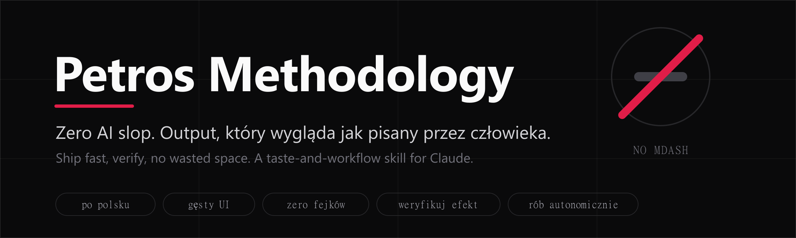

<p align="center">
  
</p>

<h1 align="center">Petros Methodology</h1>

<p align="center">
  Zero AI slop. Output, który wygląda jak pisany przez człowieka.<br>
  Skill dla Claude / Claude Code, destylat z setek realnych sesji budowania produktów dla trzeciego sektora.
</p>

---

## Kim jestem

Cześć, jestem **Petros Tovmasyan**, prezes **Fundacji Klaster Innowacji Społecznych**. Łączę dwie rzeczy, które rzadko chodzą w parze: zarządzanie organizacją pozarządową i samodzielne budowanie technologii. Na co dzień piszę projekty grantowe, prowadzę szkolenia i warsztaty, a wieczorami z pomocą AI stawiam aplikacje, które realnie usprawniają pracę mojego zespołu i innych NGO.

Wierzę, że trzeci sektor nie musi czekać na korporacyjne budżety, żeby korzystać z dobrej technologii. Dlatego buduję szybko, tanio i otwarcie, a efekty staram się oddawać innym organizacjom za darmo. Pozycjonuję klaster jako lidera praktycznego wykorzystania AI w sektorze społecznym.

## Co potrafię

Przez ostatnie miesiące zbudowałem i wdrożyłem **ponad 100 aplikacji i stron** (Lovable + Vercel) dla projektów społecznych. Konkretnie:

- **Systemy i CRM dla NGO.** KLASTER CRM do prowadzenia organizacji: projekty, zespół, feed, dokumenty, integracje z Google Drive i fakturowaniem.
- **Portale rekrutacyjne z automatyzacją.** Rekrutacja kandydatów i wolontariuszy, self-service umawianie rozmów, panele administracyjne, magic link do logowania.
- **Strony i panele projektów UE.** Erasmus+ (mobilności i wyszukiwanie partnerów), internacjonalizacja, regranting, KPO, FIO, Norway Grants.
- **Landing pages dla administracji publicznej.** Seria stron promujących bezpłatne szkolenia cyfrowe dla pracowników JST i służb, finansowane z KPO, każda dopasowana do innej grupy odbiorców.
- **Platformy e-learningowe.** Kursy wideo, katalogi szkoleń, rejestracja uczestników, panel prowadzącego.
- **Integracja migrantów i wsparcie cudzoziemców.** Wielojęzyczne portale kariery i informacji dla osób z doświadczeniem migracji na Śląsku.
- **Programy senioralne i młodzieżowe.** Strony i narzędzia dla uniwersytetów trzeciego wieku, lokalnych liderów i inkubatorów strategii młodzieżowych.
- **Eko i gospodarka obiegu zamkniętego.** Strony inicjatyw środowiskowych, generatory i narzędzia edukacyjne.
- **AI dla sektora społecznego.** Asystent spotkań oparty o offline Whisper, narzędzia do treści, generowanie wideo, projekty wdrażające AI w NGO.
- **Narzędzia wewnętrzne.** HR i umowy, masowa wysyłka maili (Resend), dopasowywanie faktur do budżetów projektów, kontrola dostępów.

**Stack, którego używam:** React, Vite, TypeScript, Tailwind CSS, shadcn/ui, Supabase (Postgres z RLS, edge functions), deploy na Vercel i Lovable. Do tego Resend, Google Drive i Sheets, OCR, Firecrawl oraz modele AI (Hugging Face, offline Whisper, Kling, Midjourney).

**Jak pracuję:** szybko, iteracyjnie, prosto z produkcji. Każdą zmianę weryfikuję realnie (audyty E2E w przeglądarce, wersja mobilna na pierwszym miejscu). Mam jedną twardą zasadę nadrzędną: efekt ma wyglądać jak zrobiony przez człowieka, nie przez AI. To z niej wyrósł ten skill.

## Portfolio (wybrane, publiczne)

- **Szkolenia KLASTER** - katalog i rejestracja na szkolenia.
- **ERASMUS MOBILITY HUB** - zarządzanie mobilnościami i partnerami w programach wymiany.
- **Akademia Internacjonalizacji** - platforma dla NGO do internacjonalizacji i fundraisingu.
- **FAMILOKI 360 2.0** - dziedzictwo przemysłowe Górnego Śląska w formie interaktywnych materiałów 360.
- **LOWE Czernichów** - obsługa edukacyjnego projektu finansowanego z UE.

Reszta to dziesiątki paneli, portali i stron budowanych dla konkretnych projektów i organizacji partnerskich.

---

## Czym jest ten skill

`Petros Methodology` to zestaw twardych reguł smaku i pracy, które sprawiają, że Claude od razu produkuje rzeczy w moim stylu: bez "AI slopu", gęsto, po ludzku, z weryfikacją i bez marnowania mojego czasu. Reguły są oznaczone siłą: **HARD** (nienegocjowalne), **STRONG** (domyślne), **SOFT** (wskazówki).

Najważniejsze reguły:

1. **Nigdy myślnika em-dash.** Wycinaj go z każdego tekstu, dokumentu, maila, UI i kodu.
2. **Zero "AI slop".** Czysta interpunkcja, bez nadużywania dwukropków, bez przewidywalnych formułek. Ma brzmieć jak człowiek.
3. **Pisz zwięźle, w języku użytkownika.**
4. **Działaj autonomicznie, całą listę, bez zbędnego dopytywania.**
5. **Weryfikuj efekt zanim powiesz "zrobione"** (E2E, mobile, potwierdzony deploy).
6. **Nie marnuj miejsca.** Gęsty, nowoczesny UI w stylu Linear/Vercel.
7. **Zero zmyślonych danych.** Brak danych = pytaj, nie wymyślaj.

Pełna treść jest w pliku [`SKILL.md`](SKILL.md) (po polsku: [`SKILL.pl.md`](SKILL.pl.md)): reguły smaku, komunikacja, formatowanie, workflow, poprzeczka jakości i tabela odczytywania intencji.

## Instalacja

Skopiuj folder do katalogu skilli:

```bash
# zasięg użytkownika
git clone https://github.com/Klaster1234/petros-methodology.git ~/.claude/skills/petros-methodology

# albo zasięg projektu
git clone https://github.com/Klaster1234/petros-methodology.git .claude/skills/petros-methodology
```

Wywołaj go przez `/petros-methodology`, albo pozwól mu aktywować się automatycznie, gdy tworzysz tekst, dokument, UI lub grafikę dla odbiorcy.

## English TL;DR

`Petros Methodology` is a Claude / Claude Code skill that makes outputs look human, not AI. The headline rule: never use em-dashes and strip "AI slop" punctuation. It also covers dense no-wasted-space UI, never fabricating data, acting autonomously, and verifying before claiming done. Full text in [`SKILL.md`](SKILL.md). MIT licensed, fork and adapt freely.

## Licencja

MIT. Korzystaj, forkuj, dostosuj do swojego smaku.
